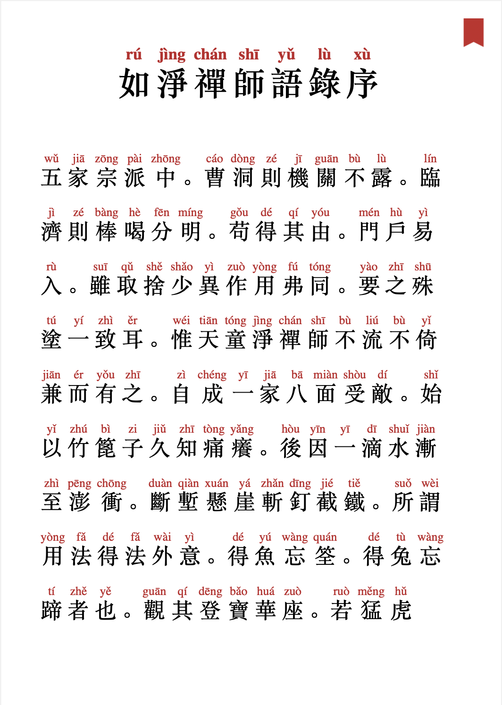
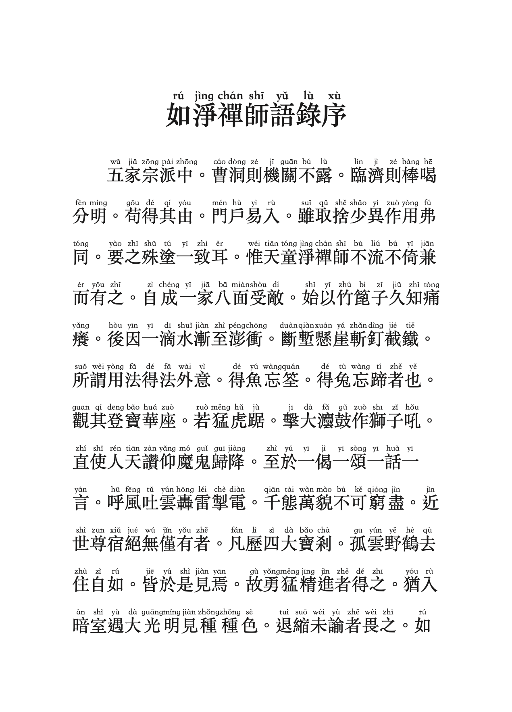

# 天童如净

天童如净禅师，日本曹洞宗开山祖师道元的师父，南宋时期人，和北方万松行秀并称曹洞宗二大宗匠。国内曹洞宗主要传自万松行秀一派，而天童如净多不为国人所知，语录序中这句，正是我的初衷吧。

> 使灯灯相续师之名愈久而愈隆

### 拼音版由来
最早是因为去宁波天童禅寺，得到了一本线装的繁体版本。或许是古文而且是繁体的缘故，有阅读障碍。后来在孔夫子上淘到了一本小开本的带拼音的，但是这个版本存在缺少部分页面，而且是简体的并且很多异体字没有的，于是就想自己编辑一个版本。

主要参照了台大佛学图书馆的[《 如净和尚语录》CBETA 电子版](http://buddhism.lib.ntu.edu.tw/BDLM/sutra/chi_pdf/sutra19/T48n2002A.pdf)，另外也参考了天童寺出版的《天童如净禅师语录》。

为了便于随时阅读，生成的PDF主要以适合手机阅读的为主。

### 如净和尚语录

对应下载`如净和尚语录.pdf`，这个版本主要使用Python脚本（generate.py）根据`book.txt`自动生成带拼音的`book.html`。可以通过浏览器打开`book.html`生成PDF版本，目前PDF是使用苹果的Safrai生成的，Safrai一方面字体使用了总体显示，在生成时可以友好的处理切换行时的标点符号的问题。

这个版本后续会一直维护，虽然目前利用分词技术解决了大量多音字的拼音问题，但少部分的拼音仍旧存在问题。遇到错误时一方面可以提交Issues。另一方面也可以修改`book.txt`, 提交给我。比如这个句子中：`今古寥寥白晝<ruby py="cháng">長</ruby>`的`長`在自动生成时会生成`zhǎng`，实际应该是`cháng `。可以使用`ruby`标签包裹，`py`是对应的拼音。生成时，将会使用标签的拼音。另外某些汉字没有拼音，这时可以将`py`设置为`-`，生成时不会显示拼音。

脚本使用了以下开源项目：

- [OpenCC](https://github.com/BYVoid/OpenCC)，处理简繁体的转换。
- [jieba](https://github.com/fxsjy/jieba)，主要处理分词。
- [python-pinyin](https://github.com/mozillazg/python-pinyin)，生成拼音，目前存在如果时繁体词组时，无法生成正确的拼音，所以使用了OpenCC来处理繁体转简体的问题。

### 天童如净禅师语录

这个是稍早前使用排版软件手动生成的版本，虽然经过很多次的修正，问题已不大，考虑到脚本生成的便利和准确性，此版本后续将不再维护。

### 道元《宝庆记》研究
《宝庆记》是道元禅师与如净禅师的一些对话集，可以从另一个角度来了解如净禅师。这个浙大华雪梅的研究论文，附录部分有《宝庆记》完整文字。网上找了一个带日文的电子版，核对了下内容基本一致，所以值得参考。
